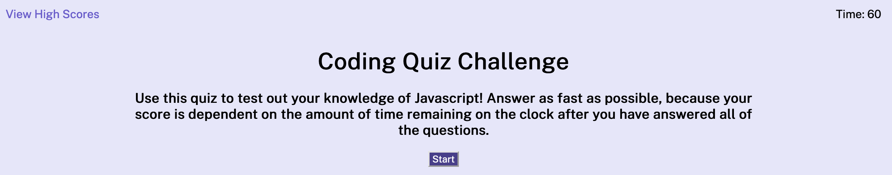

# ERQuiz

## Description 
This project attempts to build a simple JavaScript quiz to test our knowledge of the language. 
(Though, to be fair, the emphasis is on the project, not the quiz itself, which is just a few questions long.) If I were to add to the project, I would add a number of questions and then randomly generate them (without repeating any).

It combines HTML, CSS, and vanilla JavaScript to make a webpage that interactively renders components with event listeners and stores scores to local storage.

## Installation
Access the game at https://emilyerose.github.io/ERQuiz/. 
Then play around!

## Usage
Your score is based on the amount of time left on the clock when you finish the quiz! Other than that, it's pretty straightforward: click on the buttons and see what happens. you can click on 'view high scores' to see the leaderboard!

## Credits
thanks to Ben for their help on some issues I was having with this

## License
none relevant